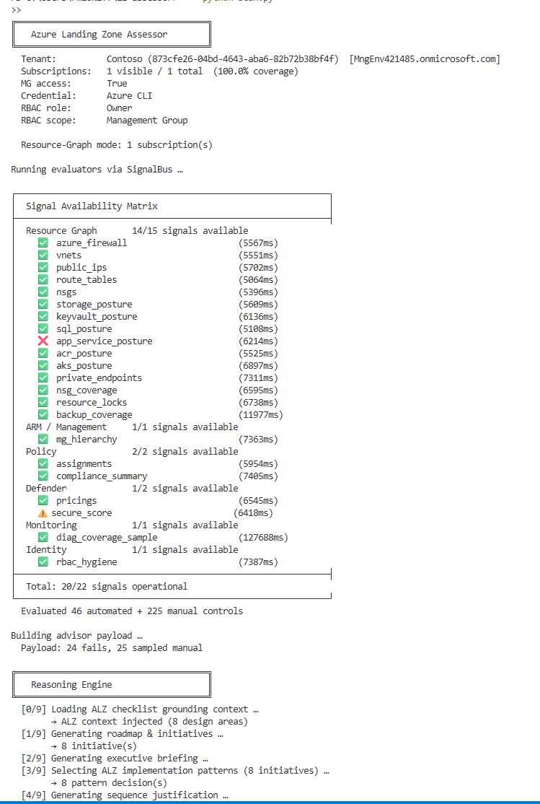
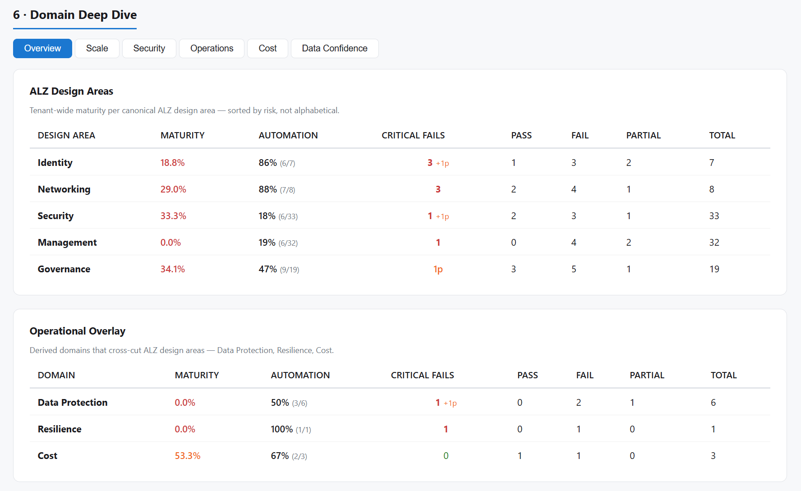
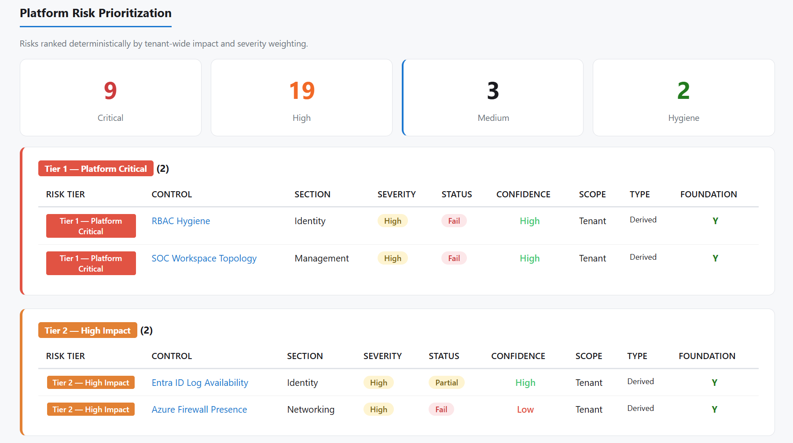

# Azure Landing Zone Assessor (`lz-assessor`)

A comprehensive, automated Azure Landing Zone assessment tool designed for **Cloud Solution Architects (CSAs)** conducting landing zone assessments. It evaluates an Azure tenant against Microsoft's [Azure Landing Zone (ALZ) checklist](https://github.com/Azure/review-checklists), scores controls deterministically, then enriches the results with AI-generated advisory output — producing a ready-to-deliver **CSA workbook**, **executive HTML report**, and **target architecture** in a single command.

## Why This Matters

Enterprise customers often have a landing zone but **lack a reliable way to measure enterprise-scale readiness and identify the architectural gaps that block transformation**.

This agent:

- Uses **read-only access (safe for customer environments)**
- Evaluates **real platform signals — not questionnaires**
- Selects controls dynamically based on **intent**
- Produces a **defensible, risk-aligned roadmap**

**Run one command → get a scored assessment, executive briefing, and a traceable 30-60-90 plan.**

> [!IMPORTANT]
> 🔍 **Open the interactive demo report:**
> 👉 **[View the HTML assessment report](https://htmlpreview.github.io/?https://github.com/rebmid/Reasoning-Agent-Azure-Landing-Zone-Assessment-Advisor/blob/main/docs/demo/Contoso-ALZ-Platform-Readiness-Report-Sample.html)**
>
> Generated from a real Azure Test/Lab "Contoso" tenant using read-only access.

---

## Demo Screenshots

| Execution Context | Control Evaluation with Evidence |
|---|---|
|  |  |

| Roadmap Traceability | Data Confidence |
|---|---|
|  |  |

| Causal Risk Analysis | Executive Report |
|---|---|
|  |  |

## Features

| Capability | Description |
|---|---|
| **Live ALZ Checklist** | Always fetches the latest checklist from the `Azure/review-checklists` GitHub repo — never stale |
| **Automated Evaluators** | Azure Resource Graph, Defender, Policy, and Management Group queries score controls as Pass / Fail / Partial |
| **Weighted Scoring** | Domain-weighted maturity model with severity multipliers |
| **7-Pass AI Advisory Pipeline** | Generates enterprise readiness, top risks, 30-60-90 roadmap, initiatives, backlog, and target architecture |
| **Microsoft Learn MCP Grounding** | Official MCP SDK retrieves real guidance, code samples, and full documentation |
| **CSA Workbook (Excel)** | Executive Summary, traceable 30-60-90 roadmap, and full Control Details sheet |
| **Executive HTML Report** | Visual maturity score, risk heatmap, and gap analysis |
| **Delta Tracking** | Shows control-level progress between runs |
| **Preflight Probes** | Validates RBAC access before a full scan |
| **Intent-Based Assessment** | Evaluates only relevant controls based on user intent |
| **Pluggable AI Provider** | Swap AOAI for another model in one line |


---

## End-to-End Reasoning Architecture

### 1. Input

- Live Azure tenant via `az login` or sanitized demo fixture
- CLI modes: `--demo`, `--preflight`, `--on-demand`, `--why DOMAIN`

### 2. Data Collection

- Azure Resource Graph
- Policy + Compliance
- Defender for Cloud
- Management Group hierarchy

### 3. Evaluation Engine

- Signal Bus routes platform telemetry → control evaluators
- ALZ control pack scoring → Pass / Fail / Partial / Manual
- Weighted maturity + risk model

### 🤖 4. AI Reasoning Engine

Builds advisor payload from scored controls, then runs a **7-pass reasoning pipeline**:

| Pass | Name | Output |
|------|------|--------|
| 1 | **Roadmap & Initiatives** | 30-60-90 plan + initiative dependency graph |
| 2 | **Executive Briefing** | Top risks + maturity narrative |
| 3 | **Enterprise-Scale Readiness** | Readiness assessment against ALZ design areas |
| 4 | **Smart Questions** | Targeted discovery questions for the customer |
| 5 | **Implementation Backlog** | Per-initiative execution plans |
| 6 | **Microsoft Learn Grounding** | MCP SDK retrieval + AI contextualisation |
| 7 | **Target Architecture** | Recommended architecture with execution units |

### 🧩 5. Why-Risk Agent (Deterministic Reasoning Layer)

- Failing controls → dependency graph impact
- Root cause → cascade effect
- Roadmap action that fixes it
- Microsoft Learn remediation reference

### 📦 6. Deliverables

| Output | Description |
|--------|-------------|
| 📊 CSA Workbook (Excel) | 3-sheet deliverable: Executive Summary (with Top Risks), 30-60-90 Roadmap, Control Details |
| 🌐 Executive HTML Report | Browser-based assessment report |
| 🧾 Run JSON | Full traceable assessment data |
| 🏗 Target Architecture JSON | AI-generated target architecture |
| ❓ Why-Analysis JSON | Causal reasoning output per risk domain |

```
Azure Tenant / Demo
        │
        ▼
Deterministic ALZ Assessment
(Resource Graph + Policy + Defender)
        │
        ▼
Control Scoring Engine
        │
        ├────────► CSA Workbook
        │
        ▼
AI Reasoning Engine
(Roadmap + Exec Brief + Target Architecture)
        │
        ▼
WHY Reasoning Layer
(Knowledge Graph + Dependency Impact)
        │
        ▼
Traceable Business Risk Explanation
```

---

## Project Structure

```
lz-assessor/
├── scan.py                      # Entry point — CLI, orchestration, output assembly
├── requirements.txt             # Python dependencies
├── .env                         # Environment variables (Azure OpenAI keys)
├── .gitignore                   # Excludes secrets, outputs, caches
│
├── demo/                        # Demo fixtures (no Azure required)
│   └── demo_run.json            #   Sanitized assessment run for --demo mode
│
├── docs/                        # Documentation assets
│   └── demo/                    #   Demo screenshots for README
│
├── alz/                         # ALZ checklist loader
│   └── loader.py                #   Fetches live from GitHub main branch
│
├── collectors/                  # Azure data collectors
│   ├── resource_graph.py        #   Resource Graph queries (VNets, firewalls, IPs, NSGs, …)
│   ├── defender.py              #   Microsoft Defender for Cloud status
│   ├── management_groups.py     #   Management group hierarchy
│   ├── policy.py                #   Azure Policy definitions
│   ├── policy_assignments.py    #   Policy assignment status
│   └── policy_compliance.py     #   Policy compliance data
│
├── signals/                     # Signal Bus architecture
│   ├── types.py                 #   EvalScope, Signal, EvalResult type definitions
│   ├── registry.py              #   SignalBus — routes signals to evaluators
│   ├── cache.py                 #   Signal caching layer
│   ├── availability.py          #   Signal availability matrix (runtime diagnostic)
│   └── providers/               #   Signal data providers
│       ├── resource_graph.py    #     Resource Graph signal provider (paginated)
│       ├── policy.py            #     Policy signal provider
│       ├── defender.py          #     Defender signal provider
│       ├── management_groups.py #     MG tree signal provider
│       ├── diagnostics.py       #     Diagnostics signal provider
│       ├── storage.py           #     Storage account posture (coverage-based)
│       ├── keyvault.py          #     Key Vault posture (coverage-based)
│       ├── sql.py               #     SQL server posture (coverage-based)
│       ├── app_services.py      #     App Service posture (coverage-based)
│       ├── containers.py        #     AKS + ACR posture (coverage-based)
│       ├── private_endpoints.py #     Private endpoint coverage
│       ├── nsg_coverage.py      #     NSG subnet coverage + empty NSG detection
│       ├── resource_locks.py    #     Resource lock inventory
│       ├── backup.py            #     VM backup coverage
│       └── rbac.py              #     RBAC hygiene (multi-subscription)
│
├── evaluators/                  # Control evaluators (auto-register on import)
│   ├── networking.py            #   Network controls (VNet, firewall, NSG, DDoS, …)
│   ├── governance.py            #   Governance controls (tags, naming, policy, …)
│   ├── security.py              #   Security controls (Defender, encryption, RBAC, …)
│   ├── data_protection.py       #   PaaS posture (Storage, KV, SQL, App Svc, ACR, PE)
│   ├── resilience.py            #   Backup coverage, resource locks
│   ├── identity.py              #   RBAC hygiene evaluator
│   ├── network_coverage.py      #   NSG subnet coverage, AKS posture
│   └── registry.py              #   Evaluator registration infrastructure
│
├── control_packs/               # Control pack definitions
│   ├── loader.py                #   Loads versioned control packs
│   └── alz/                     #   ALZ v1.0 control pack
│
├── engine/                      # Core assessment engine
│   ├── adapter.py               #   Bridges evaluators to scoring
│   ├── assessment_runtime.py    #   Deterministic assessment runner
│   ├── context.py               #   Azure execution context discovery
│   ├── scoring.py               #   Weighted scoring model + automation coverage
│   ├── delta.py                 #   Run-over-run delta computation
│   ├── rollup.py                #   Section-level result rollups
│   └── run_store.py             #   Persists/retrieves historical runs
│
├── graph/                       # Knowledge graph
│   ├── controls.json            #   Control → CAF discipline → dependency mappings
│   └── knowledge_graph.py       #   Graph query utilities
│
├── ai/                          # AI advisory module
│   ├── mcp_retriever.py         #   Microsoft Learn MCP SDK client (search, code, fetch)
│   ├── build_advisor_payload.py #   Prepares scoring data for AI consumption
│   ├── engine/
│   │   ├── aoai_client.py       #   Azure OpenAI JSON client (retry, repair, lint)
│   │   ├── reasoning_engine.py  #   7-pass AI pipeline orchestrator
│   │   └── reasoning_provider.py#   ReasoningProvider protocol + AOAI implementation
│   ├── prompts/                 #   Prompt templates (Jinja-style .txt files)
│   │   ├── system.txt           #     System persona
│   │   ├── roadmap.txt          #     30-60-90 roadmap + initiatives
│   │   ├── exec.txt             #     Executive briefing
│   │   ├── readiness.txt        #     Enterprise-scale readiness
│   │   ├── smart_questions.txt  #     Customer discovery questions
│   │   ├── implementation.txt   #     Implementation backlog items
│   │   ├── target_architecture.txt # Target architecture design
│   │   └── grounding.txt        #     MCP grounding enrichment
│   └── schemas/                 #   JSON schemas for AI output validation
│       └── domain.py            #     Domain model types
│
├── schemas/                     # Shared domain schemas
│   └── domain.py                #   Assessment domain types
│
├── agent/                       # Agent / workshop mode
│   ├── intent_orchestrator.py   #   Routes user intents to evaluators
│   ├── why_reasoning.py         #   "Why is X the top risk?" causal reasoning agent
│   ├── workshop.py              #   Workshop agent loop
│   └── session.py               #   Session state management
│
├── preflight/                   # Preflight access validation
│   └── analyzer.py              #   Probes Azure permissions before full run
│
├── reporting/                   # Output generation
│   ├── render.py                #   Jinja2 HTML report generator
│   ├── report_template.html     #   HTML template for executive report
│   └── csa_workbook.py          #   CSA workbook builder (3-sheet Excel)
│
└── out/                         # Output directory (git-ignored)
    ├── run-YYYYMMDD-HHMM.json   #   Raw assessment data
    ├── why-{domain}.json         #   Causal reasoning output (--why mode)
    ├── report.html               #   Executive HTML report
    ├── CSA_Workbook_v1.xlsx      #   CSA deliverable workbook
    └── target_architecture.json  #   AI-generated target architecture
```

---

## Prerequisites

| Requirement | Details |
|---|---|
| **Python** | 3.12 or later |
| **Azure CLI** | Installed and authenticated (`az login`) |
| **Azure Permissions** | Reader role (minimum) on target subscriptions. Management Group Reader for full hierarchy visibility. |
| **Azure OpenAI** | Required for AI features. Needs a `gpt-4.1` deployment (or any chat-completion model). Set env vars (see [Configuration](#configuration)). |
| **Git** | For cloning the repository |

### Required Azure Resource Providers

The tool queries Azure Resource Graph and ARM APIs using **read-only** calls. The following resource providers must be registered on the target subscriptions for all signals to return data. Most are registered by default on any subscription that has used the service — but if a signal returns empty, missing provider registration is the most common cause.

| Resource Provider | Signal(s) | Registered by Default? |
|---|---|---|
| `Microsoft.ResourceGraph` | All Resource Graph queries | ✅ Yes |
| `Microsoft.Network` | Firewalls, VNets, Public IPs, NSGs, Route Tables, Private Endpoints, DDoS | ✅ Yes |
| `Microsoft.Storage` | Storage Account Posture | ✅ Yes |
| `Microsoft.KeyVault` | Key Vault Posture | ✅ Yes |
| `Microsoft.Sql` | SQL Server Posture | Only if SQL is used |
| `Microsoft.Web` | App Service Posture | Only if App Service is used |
| `Microsoft.ContainerRegistry` | Container Registry Posture | Only if ACR is used |
| `Microsoft.ContainerService` | AKS Cluster Posture | Only if AKS is used |
| `Microsoft.RecoveryServices` | VM Backup Coverage | Only if Backup is configured |
| `Microsoft.Compute` | VM inventory (for backup coverage) | ✅ Yes |
| `Microsoft.Security` | Defender plans, Secure Score | ✅ Yes |
| `Microsoft.Authorization` | RBAC hygiene, Resource Locks, Policy assignments | ✅ Yes (built-in) |
| `Microsoft.PolicyInsights` | Policy compliance summary | ✅ Yes |
| `Microsoft.Management` | Management Group hierarchy | ✅ Yes |
| `Microsoft.Insights` | Diagnostics coverage | ✅ Yes |

To check registration status:

```bash
az provider show -n Microsoft.RecoveryServices --query "registrationState" -o tsv
```

To register a missing provider (requires Contributor or Owner):

```bash
az provider register -n Microsoft.RecoveryServices
```

> **Note:** If a resource type doesn't exist in the subscription (e.g., no AKS clusters), the evaluator returns **NotApplicable** — not an error. Missing provider registration only matters when you *have* those resources but the signal returns empty.

---

## Quick Start

### 1. Clone the repository

```bash
git clone https://github.com/rebmid/Reasoning-Agent-Azure-Landing-Zone-Assessment-Advisor.git
cd Reasoning-Agent-Azure-Landing-Zone-Assessment-Advisor
```

### 2. Create a virtual environment

**Windows (PowerShell):**
```powershell
python -m venv .venv
.\.venv\Scripts\Activate.ps1
```

**macOS / Linux:**
```bash
python3 -m venv .venv
source .venv/bin/activate
```

### 3. Install dependencies

```bash
pip install -r requirements.txt
```

### 4. Configure environment variables

Create a `.env` file in the project root (this file is git-ignored):

```env
AZURE_OPENAI_ENDPOINT=https://<your-resource>.openai.azure.com/
AZURE_OPENAI_KEY=<your-api-key>
```

### 5. Authenticate with Azure

```bash
az login
```

If you have multiple tenants, target the correct one:

```bash
az login --tenant <tenant-id>
```

### 6. Run the assessment

```bash
python scan.py
```

That's it. The tool will:

1. Discover your Azure execution context (tenant, subscriptions, identity)
2. Fetch the latest ALZ checklist from GitHub
3. Run all evaluators against your environment
4. Score every control with weighted domain scoring
5. Generate a 7-pass AI advisory pipeline (if OpenAI is configured)
6. Ground recommendations in Microsoft Learn documentation
7. Output all artifacts to the `out/` directory

---

## Configuration

### Environment Variables

| Variable | Required | Description |
|---|---|---|
| `AZURE_OPENAI_ENDPOINT` | For AI features | Your Azure OpenAI resource endpoint URL |
| `AZURE_OPENAI_KEY` | For AI features | API key for the Azure OpenAI resource |

### Azure OpenAI Model

The tool defaults to the `gpt-4.1` deployment. To use a different model, modify the `AOAIClient` initialization in `ai/engine/aoai_client.py`.

### API Version

Default: `2024-02-15-preview`. Configurable in `AOAIClient.__init__()`.

---

## CLI Reference

```
python scan.py [OPTIONS]
```

| Flag | Description |
|---|---|
| *(no flags)* | Full assessment: evaluate all controls + AI advisory + all reports |
| `--tenant-wide` | Scan all visible subscriptions across the tenant (default: Resource Graph subscriptions only) |
| `--pretty` | Pretty-print the final JSON to stdout after the run |
| `--preflight` | Run preflight access probes and exit — validates permissions without a full assessment |
| `--why DOMAIN` | Explain **why** a domain is the top risk — runs causal reasoning over an existing assessment |
| `--demo` | Use the bundled demo fixture (`demo/demo_run.json`) instead of live Azure data — no Azure connection required |
| `--no-ai` | Skip AI reasoning passes (useful for testing or environments without Azure OpenAI) |

### Examples

```bash
# Full assessment with AI
python scan.py

# Scan entire tenant
python scan.py --tenant-wide

# Check permissions first
python scan.py --preflight

# Full run, print JSON to console
python scan.py --pretty

# Explain why Networking is the top risk (uses latest run)
python scan.py --why Networking

# Same, but using the bundled demo data (no Azure needed)
python scan.py --why Networking --demo

# Demo mode without AI — returns raw evidence payload
python scan.py --why Networking --demo --no-ai
```

---

## Output Artifacts

All outputs are written to the `out/` directory:

| File | Description |
|---|---|
| `run-YYYYMMDD-HHMM.json` | Complete assessment data — controls, scores, AI output, delta, execution context |
| `report.html` | Interactive executive HTML report with score breakdowns and gap analysis |
| `CSA_Workbook_v1.xlsx` | 3-sheet CSA deliverable workbook (see [CSA Workbook Deep Dive](#csa-workbook-deep-dive)) |
| `target_architecture.json` | AI-generated target architecture with component recommendations and Learn references |
| `preflight.json` | *(preflight mode only)* Access probe results |

Additionally, `assessment.json` is written to the project root as a convenience copy.

---

## How It Works

### 1. Data Collection

The **collectors** module queries Azure APIs via Resource Graph, Defender, Policy, and Management Group endpoints to gather raw infrastructure data:

- **Resource Graph** — VNets, firewalls, public IPs, NSGs, route tables, storage accounts, Key Vaults, private endpoints, diagnostic settings, and more
- **Defender** — security score, coverage tier, recommendations
- **Policy** — policy definitions, assignments, and compliance state
- **Management Groups** — full hierarchy tree

All queries use `AzureCliCredential` — the same identity you authenticated with via `az login`.

### 2. Evaluation & Scoring

The **Signal Bus** architecture routes collected data through registered evaluators:

1. The ALZ checklist is fetched live from GitHub (~243 controls across Security, Networking, Governance, Identity, Platform, and Management domains)
2. Each control is matched to an evaluator (or marked `Manual` if no automated check exists)
3. Evaluators emit `Pass`, `Fail`, `Partial`, or `Info` verdicts with evidence
4. The **scoring engine** applies domain weights and severity multipliers to produce a composite risk score
5. **Automation coverage** is calculated — typically 20-30% of controls have automated evidence, with the rest requiring customer conversation

### 3. AI Reasoning Engine

When AI is enabled, a **7-pass pipeline** runs against Azure OpenAI:

| Pass | Prompt | Output | max_tokens |
|---|---|---|---|
| 1 | `roadmap.txt` | 30-60-90 transformation roadmap + named initiatives | 8000 |
| 2 | `exec.txt` | Executive briefing with business risk narrative | 4000 |
| 3 | `readiness.txt` | Enterprise-scale readiness assessment | 4000 |
| 4 | `smart_questions.txt` | Customer discovery questions per domain | 4000 |
| 5 | `implementation.txt` × N | Implementation backlog (one item per initiative) | 4000 |
| 6 | *(MCP grounding)* | Learn doc refs, code samples, full-page enrichment | — |
| 7 | `target_architecture.txt` | Target architecture + `grounding.txt` enrichment | 8000 |

The `AOAIClient` includes built-in resilience:
- **JSON fence stripping** — removes markdown ````json```` wrappers from model output
- **Truncation repair** — closes dangling brackets and strings when output is cut off
- **Retry loop** — up to 2 retries on invalid JSON responses

### 4. Grounding via Microsoft Learn MCP

The tool uses the **official MCP Python SDK** (Streamable HTTP transport) to connect to Microsoft's documentation API at `https://learn.microsoft.com/api/mcp`:

| MCP Tool | Purpose |
|---|---|
| `microsoft_docs_search` | Retrieves curated 500-token content chunks for each initiative |
| `microsoft_code_sample_search` | Fetches Bicep/Terraform code samples for infrastructure recommendations |
| `microsoft_docs_fetch` | Downloads full documentation pages as markdown for deep grounding |

If MCP is unreachable, a **fallback** uses the public Learn search REST API (`https://learn.microsoft.com/api/search`) to provide title + URL + description.

Grounding runs for:
- Each initiative in the transformation roadmap
- Each identified gap
- The target architecture

### 5. Report Generation

**HTML Report** (`report.html`):
- **Platform Readiness Snapshot** — tenant maturity score, automation coverage, enterprise-scale readiness
- **Landing Zone Adoption Blockers** — AI-identified barriers to ALZ adoption
- **Platform Risk Prioritization** — 5-tier risk classification (Critical → Hygiene) with confidence indicators
- **Highest-Impact Remediation Sequence** — prioritised initiative roadmap
- **Maturity After Roadmap Execution** — projected score improvement
- **Capability Unlock View** — capabilities enabled by completing each initiative
- **Domain Deep Dive** — per-section control tables split into ALZ Core and Operational Overlay, with automation %, critical fail counts, and risk sorting
- **Assessment Scope & Confidence** — subscription coverage, signal availability, and data-collection provenance
- **Customer Validation Required** — controls needing manual review or customer conversation
- **ALZ Design Area References** — links to official ALZ design area documentation
- **Data Collection Provenance** — collector execution metadata and timestamps

**CSA Workbook** (`CSA_Workbook_v1.xlsx`):
- See [CSA Workbook Deep Dive](#csa-workbook-deep-dive) below

---

## CSA Workbook Deep Dive

The workbook is the primary **customer-facing deliverable** — a 3-sheet Excel file ready for CSA engagements:

### Sheet 0: `0_Executive_Summary`

| Section | Content |
|---|---|
| **CSA Engagement Framing** | Engagement Objective, Key Message, Customer Outcome — ready-made talking points |
| **Assessment Metrics** | Total controls, automated %, pass/fail/partial counts, risk score |
| **Top Business Risks** | AI-identified risks with severity, affected domain, and recommended mitigation |

### Sheet 1: `1_30-60-90_Roadmap`

A phased transformation plan where each action item includes:

- **Phase** (30 / 60 / 90 day)
- **Action** and **Initiative ID**
- **CAF Discipline** alignment
- **Owner** and **Success Criteria**
- **Dependencies**
- **Related Controls** — mapped from `initiative_id` → initiative controls (GUIDs) → checklist IDs
- **Related Risks** — reverse-mapped through `top_business_risks[].affected_controls`

### Sheet 2: `2_Control_Details`

All ~243 controls in a flat table with 19 columns:

| Column | Description |
|---|---|
| A: Control ID | Checklist GUID (shortened) |
| B: Section | ALZ domain (Security, Networking, …) |
| C: Severity | Critical / High / Medium / Low |
| D: Status | Pass / Fail / Partial / Manual |
| E: Text | Original checklist text |
| F: Notes | Evidence notes from evaluator |
| G: Evidence Count | Number of evidence items |
| H: Learn URL | Microsoft Learn documentation link |
| I: Training URL | Microsoft training link |
| J: Checklist Name | Control name from ALZ checklist |
| K: Checklist Description | Full description from ALZ checklist |
| L: WAF Pillar | Well-Architected Framework alignment |
| M: Grounded Summary | AI-enriched summary with Learn references |
| N: Grounded URL | Learn documentation URL from MCP |
| O: Grounded Code | Bicep/Terraform code sample from MCP |
| P: Grounded Fetch | Full-page markdown excerpt |
| Q: Related Initiatives | Initiative IDs related to this control |
| R: Category | ALZ category |
| S: Discussion Points | Customer discovery items mapped by control (224/243 populated) |

---

## On-Demand Evaluation Mode

For targeted workshop assessments, use `--on-demand`:

```bash
python scan.py --on-demand enterprise_readiness
```

This runs the **IntentOrchestrator** which:
1. Loads the ALZ control pack
2. Routes the intent to relevant evaluators
3. Runs the assessment runtime against the targeted scope
4. Optionally generates an AI explanation of the results
5. Saves output to `out/run-*-on-demand.json`

---

## Why-Risk Reasoning (`--why`)

After a full assessment, drill into **why** a specific domain was flagged as the top risk:

```bash
python scan.py --why Networking --demo
```

This runs a **6-step causal reasoning pipeline** over the existing assessment data:

| Step | What it does |
|---|---|
| 1. **Find risk** | Matches the domain to a top business risk from the executive summary |
| 2. **Failing controls** | Extracts every Fail/Partial control tied to the risk |
| 3. **Dependency impact** | Queries the knowledge graph for downstream controls blocked by failures |
| 4. **Roadmap initiatives** | Finds transformation plan actions that address the affected controls |
| 5. **Learn grounding** | Attaches Microsoft Learn references to each initiative via MCP |
| 6. **AI causal explanation** | Sends the assembled evidence to the reasoning model for root-cause analysis |

The AI output includes:
- **Root cause** — why the domain is the top risk (current-state framing)
- **Business impact** — specific consequences tied to the evidence
- **Fix sequence** — ordered remediation steps with dependency rationale and Learn URLs
- **Cascade effect** — which downstream controls will automatically improve

Output is saved to `out/why-{domain}.json`. Use `--no-ai` to get the raw evidence payload without the AI narration.

---

## Preflight Mode

Before running a full assessment, validate your Azure permissions:

```bash
python scan.py --preflight
```

Preflight probes check:
- Subscription visibility
- Resource Graph query access
- Management group read access
- Defender API access
- Policy read access

Results are saved to `out/preflight.json` and printed to the console with pass/fail indicators.

---

## Scoring Model

### Domain Weights

| Domain | Weight | Rationale |
|---|---|---|
| Security | 1.5× | Highest impact on breach risk |
| Networking | 1.4× | Network segmentation is foundational |
| Identity | 1.4× | Identity is the new perimeter |
| Governance | 1.3× | Policy enforcement and compliance |
| Platform | 1.2× | Landing zone structural integrity |
| Management | 1.1× | Operational visibility |

### Severity Weights

| Severity | Points |
|---|---|
| Critical | 6 |
| High | 5 |
| Medium | 3 |
| Low | 1 |
| Info | 0 |

### Status Multipliers

| Status | Multiplier | Meaning |
|---|---|---|
| Fail | 1.0× | Full risk weight applied |
| Partial | 0.6× | Reduced weight — some mitigation in place |
| Pass | 0× | No risk contribution |
| Manual | 0× | Not scored — requires customer discussion |

**Composite risk score** = Σ (severity_weight × status_multiplier × domain_weight) for all controls

---

## Troubleshooting

| Problem | Solution |
|---|---|
| `AZURE_OPENAI_KEY / AZURE_OPENAI_ENDPOINT not set` | Create a `.env` file with your Azure OpenAI credentials, or run with `--no-ai` |
| `No subscriptions found` | Ensure `az login` succeeded and your identity has Reader on at least one subscription |
| `Management group hierarchy not visible` | Your identity needs Management Group Reader — the tool still works, but MG-related controls will be `Manual` |
| `Unterminated string` / JSON parse errors in AI output | The tool auto-repairs truncated JSON. If it persists, check your Azure OpenAI quota and model deployment |
| `MCP connection failed` | The tool falls back to the public Learn search API automatically. No action needed. |
| `ModuleNotFoundError` | Ensure your virtual environment is activated and `pip install -r requirements.txt` completed successfully |
| `az: command not found` | Install the [Azure CLI](https://learn.microsoft.com/en-us/cli/azure/install-azure-cli) |
| Slow execution | Large tenants take longer. Use `--tenant-wide` only when needed. AI passes add ~60-90s. |

## Built with AI Assistance

This project was developed using GitHub Copilot as an AI pair programmer for code generation, refactoring, and test scaffolding.  
All architecture, control logic, Azure integration, and reasoning workflows were designed and implemented by the author.

## License

Copyright (c) 2026 Rebekah Midkiff
