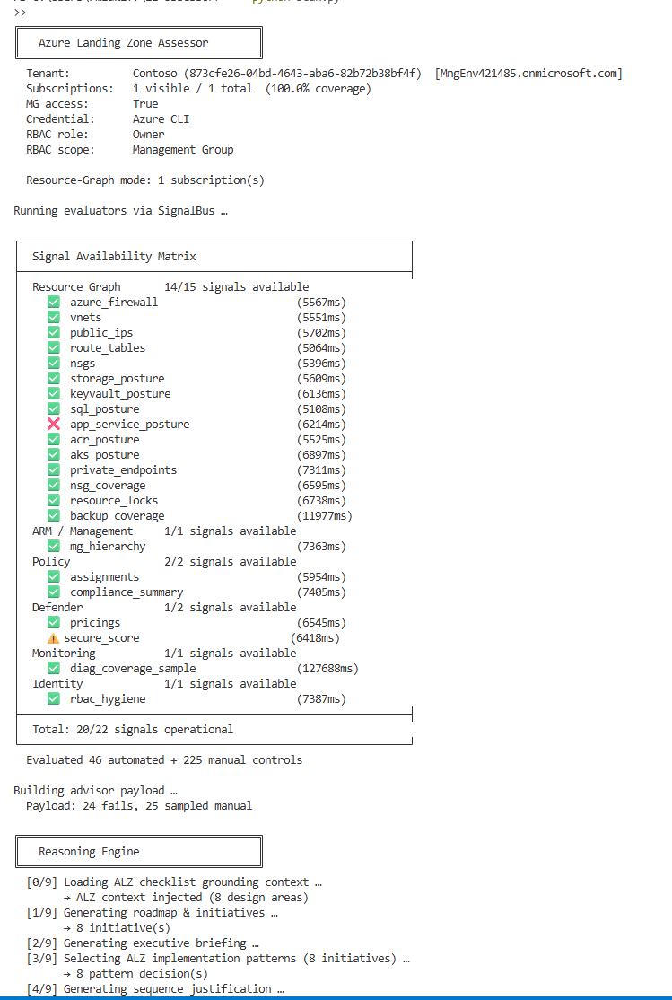
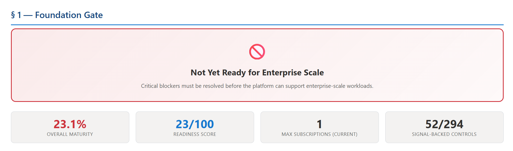
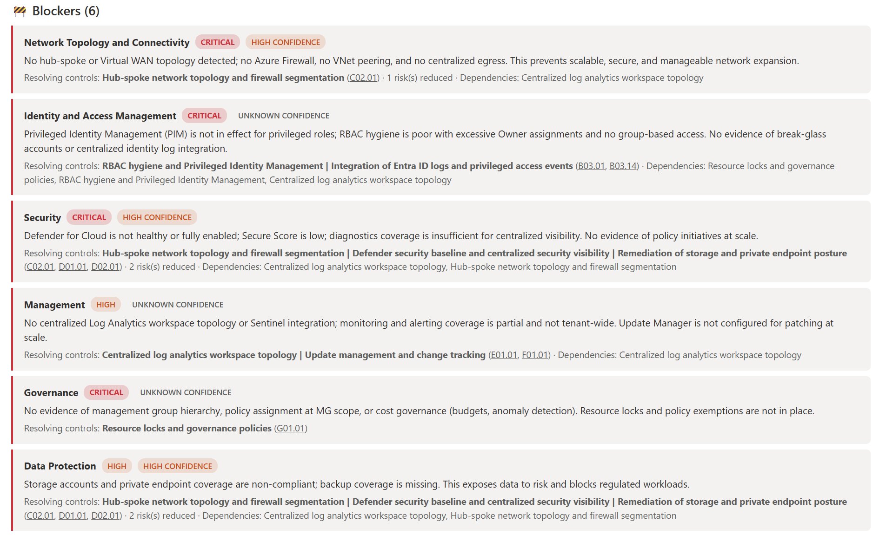
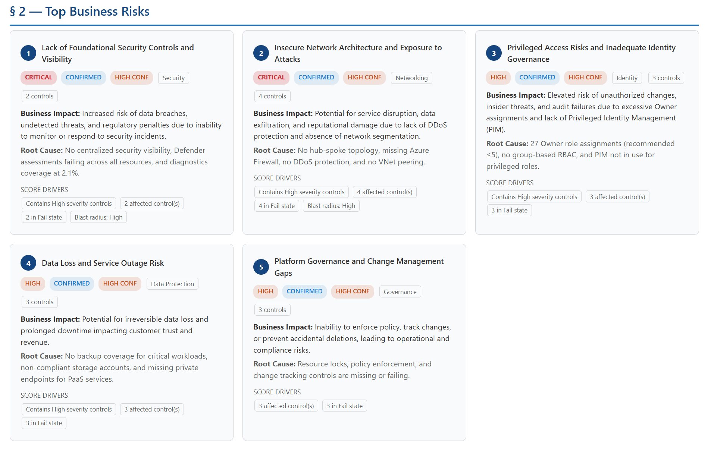
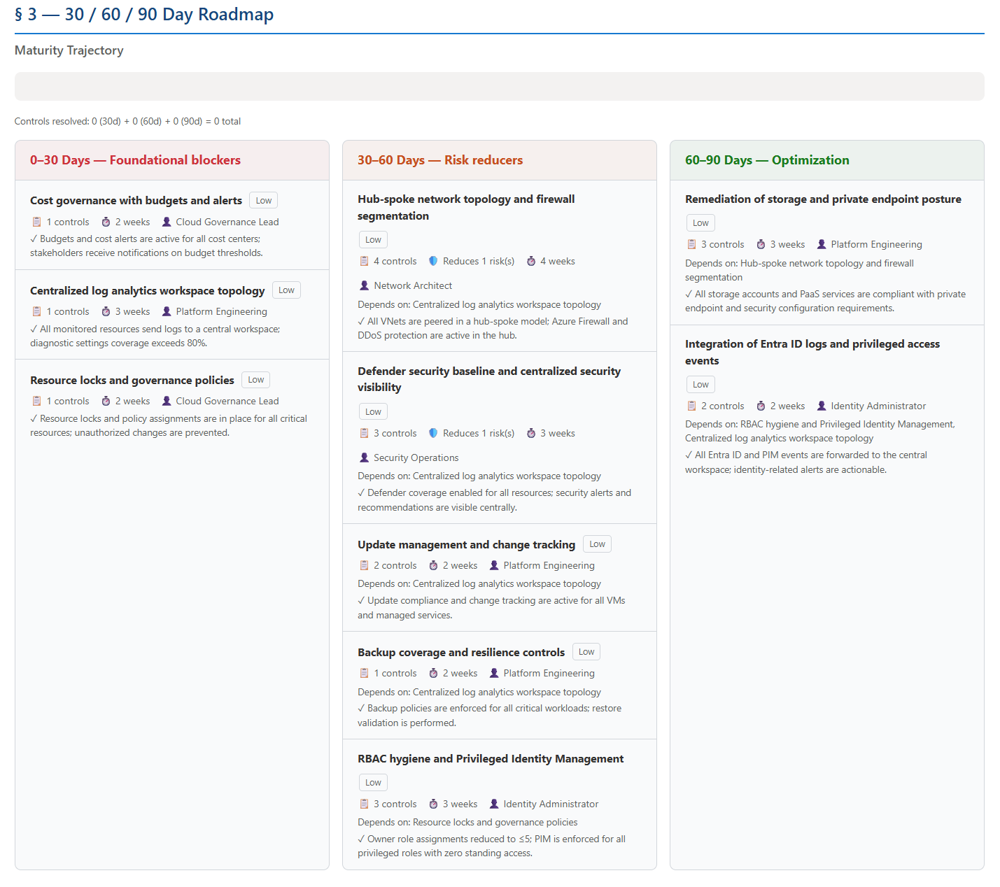
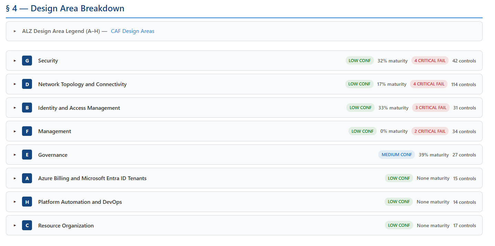
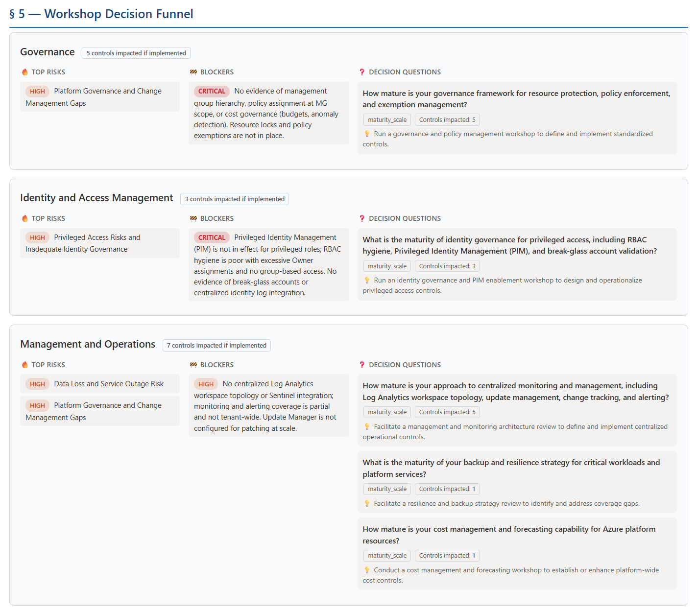
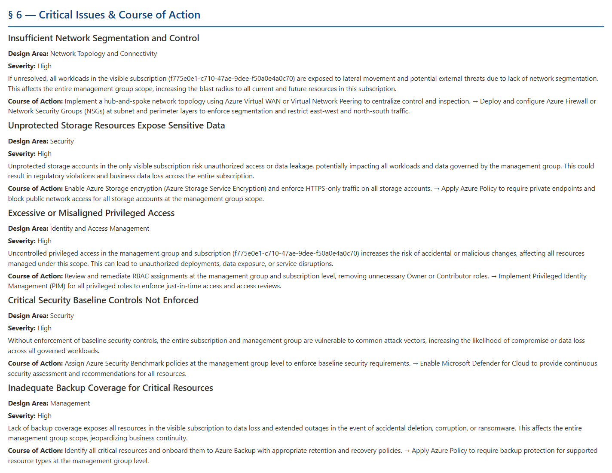

# Azure Landing Zone Assessment Engine

### Deterministic Governance Assessment with AI Reasoning

Azure Landing Zone governance reviews are typically delivered through manual workshops, slide decks, and checklist interviews.
These engagements are difficult to scale, inconsistent across architects, and rarely produce repeatable governance insights.

This project is a **deterministic Azure Landing Zone assessment engine** with a multi-stage AI reasoning layer.

The platform operates in two layers:

### Deterministic Assessment Engine
Evaluates Azure Landing Zone posture using live Azure telemetry and the official [Azure Landing Zone Review Checklist](https://github.com/Azure/review-checklists). Scores controls, computes maturity, and produces customer-ready deliverables -- all without AI.

### AI Reasoning Layer
Consumes the deterministic output and performs structured multi-step reasoning:

1. Dependency graph impact analysis
2. Initiative ordering based on structural constraints
3. Causal "why-risk" chain construction
4. Grounded remediation using Microsoft Learn MCP

**The AI does not score. It reasons over scored evidence.**

The result is a **repeatable, evidence-driven governance assessment powered by real Azure telemetry.**

> **Run one command -- get a scored assessment, executive briefing, and a traceable 30-60-90 transformation plan.**

---

## What the Engine Produces

| Artifact | Description |
|---|---|
| **HTML Report** | Interactive CSA Decision-Driven platform readiness report with design area breakdown |
| **CSA Workbook** | 3-sheet Excel workbook (`.xlsm`) ready for customer engagements |
| **30-60-90 Roadmap** | Dependency-ordered transformation plan with checklist ID traceability |
| **Assessment JSON** | Complete traceable assessment data (controls, scores, AI output, execution context) |
| **Target Architecture** | Recommended architecture with Microsoft Learn references |


## 📸 Demo Walkthrough

The following screenshots show the output of a full Azure Landing Zone assessment executed against a real Azure test tenant using **read-only access**.

---

### Assessment Execution Context

The scanner discovers tenant scope, management groups, and subscriptions before collecting platform signals.

This validates access, confirms scope, and ensures signal availability before evaluation begins.



---

### Enterprise Readiness Gate

A deterministic readiness gate determines whether the platform foundation is prepared for enterprise-scale landing zone adoption.

This gate aggregates critical control failures and platform maturity indicators.



---

### Enterprise Readiness Blockers

Structural gaps preventing enterprise-scale landing zone adoption.

These blockers are derived directly from failing controls and dependency graph analysis.



---

### Top Business Risks

Deterministically ranked platform risks with root cause analysis and supporting control evidence.



---

### Transformation Roadmap

Dependency-ordered **30-60-90 remediation initiatives** generated from the control graph.

Each initiative resolves multiple failing controls and unlocks platform capabilities.



---

### Roadmap Traceability

Every remediation initiative is mapped back to the failing controls and checklist IDs that caused it.


---

### ALZ Design Area Breakdown

Detailed maturity scoring across governance, networking, identity, security, and platform design areas.



---

### Workshop Decision Funnel

CSA workshop facilitation view that connects:

**platform blockers → business risks → remediation initiatives**



---

### CSA Workbook Deliverables

Customer-ready Excel outputs automatically generated from the assessment.

#### Executive Summary


#### 30-60-90 Transformation Plan


#### Full Control Traceability


---

### Critical Issues & Course of Action

The reasoning engine identifies the most critical platform risks and provides architecture-aligned remediation guidance.



---

### Interactive Report

> **Open the full interactive demo report**

👉 **[View the HTML assessment report](https://htmlpreview.github.io/?https://github.com/rebmid/Reasoning-Agent-Azure-Landing-Zone-Assessment-Advisor/blob/main/docs/demo/Contoso-ALZ-Platform-Readiness-Report-Sample.html)**

Generated from a real Azure Test/Lab **Contoso tenant** using read-only access.

## Architectural Characteristics

| Principle | Implementation |
|---|---|
| **Deterministic First** | All scoring, risk tiers, and control verdicts are computed from live Azure signals before AI executes |
| **Checklist-Grounded** | Every remediation item maps to an official Azure Review Checklist ID -- no synthetic identifiers |
| **One-Way Data Flow** | AI consumes scored results but cannot modify deterministic outputs |
| **Schema-Enforced Output** | All AI responses are validated against JSON schemas before acceptance |
| **Documentation-Grounded** | Microsoft Learn MCP integration enriches outputs with official implementation guidance |
| **Traceable Deliverables** | CSA Workbook, HTML Report, and Run JSON preserve referential integrity end-to-end |

---

## End-to-End Architecture

> **Architecture Principle -- One-Way Data Flow**
>
> Deterministic assessment **feeds** the AI reasoning layer. Control verdicts and risk scores are final before AI executes.

```
Azure Tenant / Demo
        |
        v
Deterministic ALZ Assessment
(Resource Graph + Policy + Defender)
        |
        v
Control Scoring Engine
        |
        |------- one-way feed ------+
        |                           v
        +---------> CSA Workbook   AI Reasoning Engine
        |                           |
        |                           v
        |                     MCP Grounding Layer
        |            (Microsoft Learn retrieval + patterns)
        |                           |
        |                           v
        |                         WHY Reasoning Layer
        |
        +---------------------------+
                    |
                    v
          Traceable Deliverables
```

### Data Collection

- Azure Resource Graph
- Policy + Compliance
- Defender for Cloud
- Management Group hierarchy

### Evaluation Engine

- Signal Bus routes platform telemetry to control evaluators
- ALZ control pack scoring: Pass / Fail / Partial / Manual
- Weighted maturity + risk model

### AI Reasoning Engine

| Pass | Name | Output |
|---|---|---|
| 1 | **Roadmap & Initiatives** | 30-60-90 plan + initiative dependency graph |
| 2 | **Executive Briefing** | Top risks + maturity narrative |
| 3 | **Implementation Decision** | ALZ implementation pattern selection per initiative |
| 4 | **Sequence Justification** | Initiative ordering rationale + engagement recommendations |
| 5 | **Enterprise-Scale Readiness** | Readiness assessment against ALZ design areas |
| 6 | **Smart Questions** | Targeted discovery questions for the customer |
| 7 | **Implementation Backlog** | Per-initiative execution plans |
| 8 | **Microsoft Learn Grounding** | MCP SDK retrieval + ALZ-aware contextualisation |
| 9 | **Target Architecture** | Recommended architecture with execution units |
| 10 | **Critical Issues** | Top failing controls advisory with course of action |
| 11 | **Blocker Resolution** | Enterprise readiness blocker resolution summary |

### Why-Risk Agent (Deterministic Reasoning Layer)

- Failing controls -> dependency graph impact
- Root cause -> cascade effect
- Roadmap action that fixes it
- Microsoft Learn remediation reference

---

## Prerequisites

| Requirement | Details |
|---|---|
| **Python** | 3.12 or later |
| **Azure CLI** | Installed and authenticated (`az login`) |
| **Azure Permissions** | Reader role (minimum) on target subscriptions. Management Group Reader for full hierarchy visibility. |
| **Azure OpenAI** | Required for AI features. Needs a `gpt-4.1` deployment (or any chat-completion model). Set env vars (see [Configuration](#configuration)). |
| **Git** | For cloning the repository |

### Required Azure Resource Providers

The tool queries Azure Resource Graph and ARM APIs using **read-only** calls. The following resource providers must be registered on the target subscriptions for all signals to return data. Most are registered by default on any subscription that has used the service -- but if a signal returns empty, missing provider registration is the most common cause.

| Resource Provider | Signal(s) | Registered by Default? |
|---|---|---|
| `Microsoft.ResourceGraph` | All Resource Graph queries | Yes |
| `Microsoft.Network` | Firewalls, VNets, Public IPs, NSGs, Route Tables, Private Endpoints, DDoS | Yes |
| `Microsoft.Storage` | Storage Account Posture | Yes |
| `Microsoft.KeyVault` | Key Vault Posture | Yes |
| `Microsoft.Sql` | SQL Server Posture | Only if SQL is used |
| `Microsoft.Web` | App Service Posture | Only if App Service is used |
| `Microsoft.ContainerRegistry` | Container Registry Posture | Only if ACR is used |
| `Microsoft.ContainerService` | AKS Cluster Posture | Only if AKS is used |
| `Microsoft.RecoveryServices` | VM Backup Coverage | Only if Backup is configured |
| `Microsoft.Compute` | VM inventory (for backup coverage) | Yes |
| `Microsoft.Security` | Defender plans, Secure Score | Yes |
| `Microsoft.Authorization` | RBAC hygiene, Resource Locks, Policy assignments | Yes (built-in) |
| `Microsoft.PolicyInsights` | Policy compliance summary | Yes |
| `Microsoft.Management` | Management Group hierarchy | Yes |
| `Microsoft.Insights` | Diagnostics coverage | Yes |

To check registration status:

```bash
az provider show -n Microsoft.RecoveryServices --query "registrationState" -o tsv
```

To register a missing provider (requires Contributor or Owner):

```bash
az provider register -n Microsoft.RecoveryServices
```

> **Note:** If a resource type doesn't exist in the subscription (e.g., no AKS clusters), the evaluator returns **NotApplicable** -- not an error. Missing provider registration only matters when you *have* those resources but the signal returns empty.

---

## Quick Start

### 1. Clone the repository

```bash
git clone https://github.com/rebmid/Reasoning-Agent-Azure-Landing-Zone-Assessment-Advisor.git
cd Reasoning-Agent-Azure-Landing-Zone-Assessment-Advisor
```

### 2. Create a virtual environment

**Windows (PowerShell):**
```powershell
python -m venv .venv
.\.venv\Scripts\Activate.ps1
```

**macOS / Linux:**
```bash
python3 -m venv .venv
source .venv/bin/activate
```

### 3. Install dependencies

```bash
pip install -r requirements.txt
```

### 4. Configure environment variables

Create a `.env` file in the project root (this file is git-ignored):

```env
AZURE_OPENAI_ENDPOINT=https://<your-resource>.openai.azure.com/
AZURE_OPENAI_KEY=<your-api-key>
```

The tool expects a **`gpt-4.1`** deployment (or any chat-completion model) on the Azure OpenAI resource.

> **Without these credentials**, the assessment still runs -- all deterministic scoring, control evaluation, and data collection work normally. However, the 11-pass AI reasoning pipeline will be skipped, meaning these report sections will be empty:
> - 30-60-90 Transformation Roadmap
> - Executive Briefing & Top Business Risks
> - Enterprise-Scale Readiness & Blockers
> - Critical Issues & Course of Action
> - Workshop Decision Funnel smart questions
> - Microsoft Learn MCP grounding
>
> Use `--no-ai` to explicitly skip AI, or omit the `.env` file to skip silently.

### 5. Authenticate with Azure

```bash
az login
```

If you have multiple tenants, target the correct one:

```bash
az login --tenant <tenant-id>
```

### 6. Run the assessment

```bash
python scan.py                    # scans the default subscription
python scan.py --demo             # demo mode -- no Azure connection required
python scan.py --mg-scope <mg-id> # scope to a management group (recommended for CSA)
python scan.py --tenant-wide      # all visible subscriptions (large tenants: use --mg-scope instead)
```

See the [CLI Reference](#cli-reference) for all available modes and flags.

The tool will:

1. Discover your Azure execution context (tenant, subscriptions, identity)
2. Fetch the latest ALZ checklist from GitHub (~255 controls)
3. Run all evaluators against your environment
4. Score every control with weighted domain scoring
5. Run the 11-pass AI reasoning pipeline (requires `.env` -- see step 4)
6. Ground recommendations in Microsoft Learn documentation via MCP
7. Output all artifacts to the `out/` directory

---

## Configuration

### Environment Variables

| Variable | Required | Description |
|---|---|---|
| `AZURE_OPENAI_ENDPOINT` | For AI features | Your Azure OpenAI resource endpoint URL |
| `AZURE_OPENAI_KEY` | For AI features | API key for the Azure OpenAI resource |

All variables can be set in a `.env` file in the project root (loaded automatically via `python-dotenv`) or as system environment variables.

### Azure OpenAI Model

The tool defaults to the **`gpt-4.1`** deployment name. To use a different model, modify the `AOAIClient` initialization in `ai/engine/aoai_client.py`.

### API Version

Default: `2024-02-15-preview`. Configurable in `AOAIClient.__init__()`.

---

## Output Artifacts

All outputs are written to the `out/` directory:

| File | Description |
|---|---|
| `run-YYYYMMDD-HHMM.json` | Complete assessment data -- controls, scores, AI output, delta, execution context |
| `report.html` | Interactive executive HTML report with design area breakdown and gap analysis |
| `run-YYYYMMDD-HHMM_CSA_Workbook.xlsm` | 3-sheet CSA deliverable workbook (see [CSA Workbook Deep Dive](#csa-workbook-deep-dive)) |
| `target_architecture.json` | Target architecture recommendation with component recommendations and Learn references |
| `preflight.json` | *(preflight mode only)* Access probe results |

Additionally, `assessment.json` is written to the project root as a convenience copy.

---

## How It Works

### 1. Data Collection

The **collectors** module queries Azure APIs via Resource Graph, Defender, Policy, and Management Group endpoints:

- **Resource Graph** -- VNets, firewalls, public IPs, NSGs, route tables, storage accounts, Key Vaults, private endpoints, diagnostic settings
- **Defender** -- security score, coverage tier, recommendations
- **Policy** -- policy definitions, assignments, and compliance state
- **Management Groups** -- full hierarchy tree

All queries use `AzureCliCredential` -- the same identity you authenticated with via `az login`.

### 2. Evaluation & Scoring

The **Signal Bus** architecture routes collected data through registered evaluators:

1. The ALZ checklist is fetched live from GitHub (~255 controls across 8 design areas)
2. Each control is matched to an evaluator (59 automated) or marked `Manual` if no automated check exists
3. Evaluators emit `Pass`, `Fail`, `Partial`, or `Info` verdicts with evidence
4. The **scoring engine** applies domain weights and severity multipliers to produce a composite risk score
5. **Automation coverage** is calculated -- 59 controls have automated evaluators (~23%), with the rest requiring customer conversation

### 3. AI Reasoning Engine

The AI layer is a **consumer** of the deterministic scoring output -- it receives the scored controls, risk tiers, and evidence via `build_advisor_payload()` and produces advisory content. It never modifies or feeds back into deterministic verdicts.

When AI is enabled, an **11-pass reasoning pipeline** runs against Azure OpenAI:

| Pass | Prompt | Output | max_tokens |
|---|---|---|---|
| 1 | `roadmap.txt` | 30-60-90 transformation roadmap + named initiatives | 8000 |
| 2 | `exec.txt` | Executive briefing with business risk narrative | 8000 |
| 3 | `implementation_decision.txt` | ALZ implementation pattern selection per initiative | 8000 |
| 4 | `sequence_justification.txt` | Initiative ordering rationale + engagement recommendations | 8000 |
| 5 | `readiness.txt` | Enterprise-scale landing zone technical readiness | 8000 |
| 6 | `smart_questions.txt` | Customer discovery questions per domain | 8000 |
| 7 | `implementation.txt` x N | Implementation backlog (one item per initiative) | 4000 |
| 8 | *(MCP grounding)* | Learn doc refs, code samples, full-page enrichment | -- |
| 9 | `target_architecture.txt` | Target architecture + `grounding.txt` enrichment | 8000 |
| 10 | `critical_issues.txt` | Top failing controls advisory with course of action | 8000 |
| 11 | `blocker_resolution.txt` | Enterprise readiness blocker resolution summary | 8000 |

The `AOAIClient` includes built-in resilience:
- **JSON fence stripping** -- removes markdown code fences from model output
- **Truncation repair** -- closes dangling brackets and strings when output is cut off
- **Retry loop** -- up to 2 retries on invalid JSON responses

### 4. Grounding via Microsoft Learn MCP

The tool uses the **official MCP Python SDK** (Streamable HTTP transport) to connect to Microsoft's documentation API:

| MCP Tool | Purpose |
|---|---|
| `microsoft_docs_search` | Retrieves curated 500-token content chunks for each initiative |
| `microsoft_code_sample_search` | Fetches Bicep/Terraform code samples for infrastructure recommendations |
| `microsoft_docs_fetch` | Downloads full documentation pages as markdown for deep grounding |

If MCP is unreachable, a **fallback** uses the public Learn search REST API to provide title + URL + description.

Grounding runs for:
- Each initiative in the transformation roadmap
- Each identified gap
- The target architecture

### 5. Report Generation

**HTML Report** (`report.html`):
- Foundation Gate -- enterprise-scale readiness with pass/fail blockers
- Top Business Risks -- deterministically ranked with root cause analysis
- 30-60-90 Transformation Roadmap with maturity trajectory
- Design Area Breakdown -- controls grouped by the 8 official ALZ design areas (A-H)
- Workshop Decision Funnel -- blockers, risks, and smart questions per domain
- Critical Issues & Course of Action

**CSA Workbook** (`CSA_Workbook_v1.xlsm`):
- See [CSA Workbook Deep Dive](#csa-workbook-deep-dive) below

---

## CSA Workbook Deep Dive

The workbook complements the HTML report as a **customer-facing deliverable** -- a 3-sheet Excel file ready for CSA engagements:

### Sheet 0: `0_Executive_Summary`

| Section | Content |
|---|---|
| **CSA Engagement Framing** | Engagement Objective, Key Message, Customer Outcome |
| **Assessment Metrics** | Total controls, automated %, pass/fail/partial counts, risk score |
| **Top Business Risks** | AI-identified risks with severity, affected domain, and recommended mitigation |

### Sheet 1: `1_30-60-90_Roadmap`

A phased transformation plan where each action item includes:

- **Phase** (30 / 60 / 90 day)
- **Action** and **Checklist ID** (canonical ALZ checklist ID, e.g. `A01.01`)
- **CAF Discipline** alignment
- **Owner** and **Success Criteria**
- **Dependencies**
- **Related Controls** -- mapped from `checklist_id` to item controls to checklist IDs
- **Related Risks** -- reverse-mapped through `top_business_risks[].affected_controls`

### Sheet 2: `2_Control_Details`

All ~255 controls in a flat table:

| Column | Description |
|---|---|
| A: ID | ALZ checklist ID (e.g. `D07.01`) |
| B: Design Area | Official ALZ design area name |
| C: Sub Area | ALZ sub-area |
| D: WAF Pillar | Well-Architected Framework alignment |
| E: Service | Azure service |
| F: Checklist Item | Original checklist text |
| G: Severity | High / Medium / Low / Info |
| H: Status | Fulfilled / Open / Not verified / N/A |
| I: Comment | Evidence notes from evaluator |
| J-L | AMMP, Learn link, Training link |
| M-O | Coverage: % Compliant, Subs Affected, Scope Level |

---

## Why-Risk Reasoning (`--why`)

After a full assessment, drill into **why** a specific domain was flagged as the top risk:

```bash
python scan.py --why Networking --demo
```

This runs a **6-step causal reasoning pipeline** over the existing assessment data:

| Step | What it does |
|---|---|
| 1. **Find risk** | Matches the domain to a top business risk from the executive summary |
| 2. **Failing controls** | Extracts every Fail/Partial control tied to the risk |
| 3. **Dependency impact** | Queries the knowledge graph for downstream controls blocked by failures |
| 4. **Roadmap initiatives** | Finds transformation plan actions that address the affected controls |
| 5. **Learn grounding** | Attaches Microsoft Learn references to each initiative via MCP |
| 6. **AI causal explanation** | Sends the assembled evidence to the reasoning model for root-cause analysis |

The AI output includes:
- **Root cause** -- why the domain is the top risk
- **Business impact** -- specific consequences tied to the evidence
- **Fix sequence** -- ordered remediation steps with dependency rationale and Learn URLs
- **Cascade effect** -- which downstream controls will automatically improve

Output is saved to `out/why-{domain}.json`. Use `--no-ai` to get the raw evidence payload without the AI narration.

---

## Preflight Mode

Before running a full assessment, validate your Azure permissions:

```bash
python scan.py --preflight
```

Preflight probes check:
- Subscription visibility
- Resource Graph query access
- Management group read access
- Defender API access
- Policy read access

Results are saved to `out/preflight.json` and printed to the console with pass/fail indicators.

---

## Scoring Model

### Domain Weights

| Domain | Weight | Rationale |
|---|---|---|
| Security | 1.5x | Highest impact on breach risk |
| Networking | 1.4x | Network segmentation is foundational |
| Identity | 1.4x | Identity is the new perimeter |
| Governance | 1.3x | Policy enforcement and compliance |
| Data Protection | 1.3x | Regulatory alignment |
| Resilience | 1.2x | Business continuity |
| Management | 1.1x | Operational visibility |
| Cost | 1.0x | Financial governance |

### Severity Weights

| Severity | Points |
|---|---|
| High | 5 |
| Medium | 3 |
| Low | 1 |
| Info | 0 |

### Status Multipliers

| Status | Multiplier | Meaning |
|---|---|---|
| Fail | 1.0x | Full risk weight applied |
| Partial | 0.6x | Reduced weight -- some mitigation in place |
| Pass | 0x | No risk contribution |
| Manual | 0x | Not scored -- requires customer discussion |

**Composite risk score** = sum of (severity_weight x status_multiplier x domain_weight) for all controls

---

## ALZ Design Area Mapping

The HTML report and Excel workbook use the official [Azure Landing Zone design areas](https://learn.microsoft.com/en-us/azure/cloud-adoption-framework/ready/landing-zone/design-areas) with checklist ID prefixes A-H from the [Azure Review Checklist](https://github.com/Azure/review-checklists):

| Letter | Design Area | Objective |
|---|---|---|
| **A** | Azure Billing and Microsoft Entra ID Tenants | Proper tenant creation, enrollment, and billing setup are important early steps. |
| **B** | Identity and Access Management | Identity and access management is a primary security boundary in the public cloud. |
| **C** | Resource Organization | Subscription design and management group hierarchy impact governance, operations, and adoption patterns. |
| **D** | Network Topology and Connectivity | Networking and connectivity decisions are an equally important foundational aspect of any cloud architecture. |
| **E** | Governance | Automate auditing and enforcement of governance policies. |
| **F** | Management | A management baseline is required to provide visibility, operations compliance, and protect and recover capabilities. |
| **G** | Security | Implement controls and processes to protect your cloud environments. |
| **H** | Platform Automation and DevOps | Align the best tools and templates to deploy your landing zones and supporting resources. |

These IDs match the `checklist_ids` in the ALZ control pack and the ID column in the CSA Workbook.

---

## Troubleshooting

| Problem | Solution |
|---|---|
| `AZURE_OPENAI_KEY / AZURE_OPENAI_ENDPOINT not set` | Create a `.env` file with your Azure OpenAI credentials, or run with `--no-ai` |
| `No subscriptions found` | Ensure `az login` succeeded and your identity has Reader on at least one subscription |
| `Management group hierarchy not visible` | Your identity needs Management Group Reader -- the tool still works, but MG-related controls will be `Manual` |
| `Unterminated string` / JSON parse errors | The tool auto-repairs truncated JSON. If it persists, check your Azure OpenAI quota and model deployment |
| `MCP connection failed` | The tool falls back to the public Learn search API automatically. No action needed. |
| `ModuleNotFoundError` | Ensure your virtual environment is activated and `pip install -r requirements.txt` completed successfully |
| `az: command not found` | Install the [Azure CLI](https://learn.microsoft.com/en-us/cli/azure/install-azure-cli) |
| Slow execution | Large tenants take longer. Use `--mg-scope <mg-id>` to limit scope instead of `--tenant-wide`. AI passes add ~60-90s. For 50+ subscriptions, expect 3-5 minutes without AI. |

---

## Built with AI Assistance

This project was developed using GitHub Copilot as an AI pair programmer for code generation, refactoring, and test scaffolding.

All architecture, control logic, Azure integration, and reasoning workflows were designed and implemented by the author Rebekah Midkiff.
